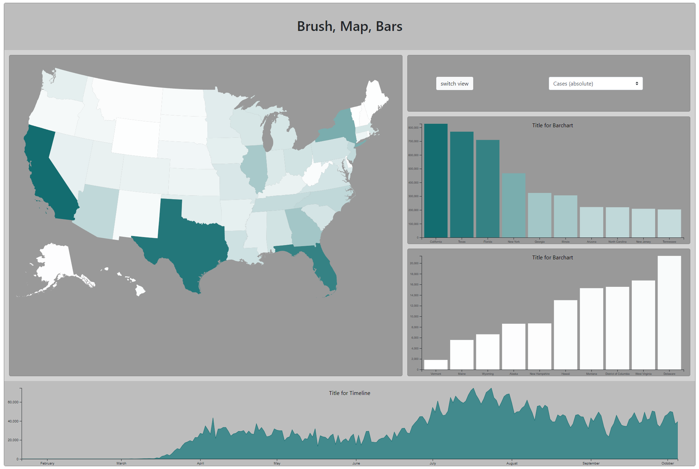

# Session 10


&nbsp;
### Template: Session_09 's Solution



We seccessfully created the map view and bar view from our previous session. Today's task is to make this dashboard much more interesting: adding the interaction and animation! 


## Task Overview

1. **Download the template**

	Download the template from canvas: [Template.zip](https://canvas.harvard.edu/courses/119923/files/17738087/download?download_frd=1)
	
	&nbsp;


2. **Complete the class MapVis interaction**

    (see ***Task: MapVis*** for more information)
    
    &nbsp;

3. **Complete the class BarVis interaction**

    (see ***Task: BarVis*** for more information)
    
    &nbsp;

5. **Prettify**

    link views, add titles, axis, legends, etc.
    
    &nbsp; 

# Tasks 

----

	

## Task I -  MapVis

1. **Add tooltip to the map**
    * Add a tooltip when you hover over a state and provide all
      information, i.e. absolute and relative covid cases and deaths.
    * You can define and add `tooltip` in the `initVis()`

   ```javascript
   vis.tooltip = d3.select("body").append('div')
               .attr('class', "tooltip")
               .attr('id', 'barTooltip')
   ```
2. **Explore mouse hover effect**

   * We have prepared the mouse event structure in `updateMap()` for you:
   ```javascript
   .on('mouseover', function (event, d) {
       //effect when mouse hover
   })
   
   .on('mouseout', function (event, d) {
       //effect when mouse move out
   })
   ```
  * Inside `mouseover`, use `console.log` to get a better sense of what information are `event` and `d` providing. Think about how can they be used in implementing interaction.

&nbsp;

3. **Change state color when hovered**

   * As you can see in the screenshot, we expect a different filled color when we hover on a state. `d3.select()` is a useful method for this task. 

   ```javascript
    d3.select("element")
       .attr...
   ```
   * You should also apply the corresponding `mouseout` effect so that when mouse is no longer hovered on the state,
     the color will change back.

   &nbsp;
   
4. **Make tooltip appear when hover**

   * As you have created a `tooltip` object in the first step, now you should define its `style` in the `updateMap()` 
   so that it appears next to the state that is hovered. The `event` data structure you explored in step 2 is very useful in this step.
   * You will also need this code for your `tooltip` object. This is for manipulating the `html` directly from JavaScript, ie, the information that we want to display on our website.
   ```javascript
   .html(`
         <div style="border: thin solid grey; border-radius: 5px; background: lightgrey; padding: 20px">
             <h3>${stateData.state}<h3>
             <h4> Population: ${stateData.population}</h4>
             <h4> Cases (absolute): ${stateData.absCases}</h4>
             <h4> Deaths (absolute): ${stateData.absDeaths}</h4>
         </div>`)
   ```
   * You should also apply the corresponding `mouseout` effect so that when mouse is no longer hovered on the state,
   the `tooltip` will disappear.


----


## Task II -  BarVis

Now that you have implemented the interactions in mapVis, the tasks for barVis will be rather similar and easy.

1. **Add animation to bar chart**

    * Now that we have drew the bar chart, add animation to the `rect` so that when you brush on timeline, the bars will transit to the new position and color.
      You will be using `merge()` `transition()` and `duration()` in order to achieve the result.

   &nbsp;

2. **Add a tooltip**

    Add a tooltip when hovering over a bar as it's displayed in the screenshot. 
3. **Make tooltip appear when hover**
   * Reference to how we did in mapVis
4. **Change bar filled color when hover**
   * Reference to how we did in mapVis

&nbsp;

---


## Bonus Task

1. **Add circles on the map**

   * As you can see in the screenshot, try adding those circles that visualizes the case number with varying radius.

2. **Link views**
   * Link map to timeline by calling the following function in your `mouseover` and `mouseout` method. Same for bar char.
   ```javascript
   myBrushVis.wrangleDataResponsive();
   ```
   * Implement the linking interction so that when you hover on a state on map, it also highlights the same state on bar chart.


&nbsp;

---

**Congratulations for finishing this week's final project and your summer school at Harvard!**
